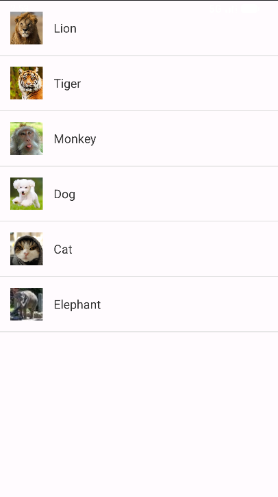
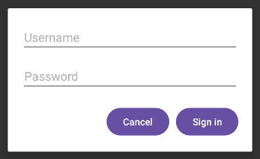
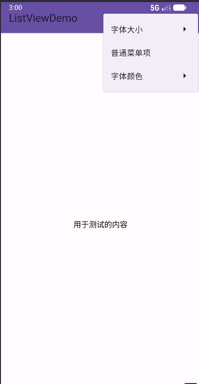
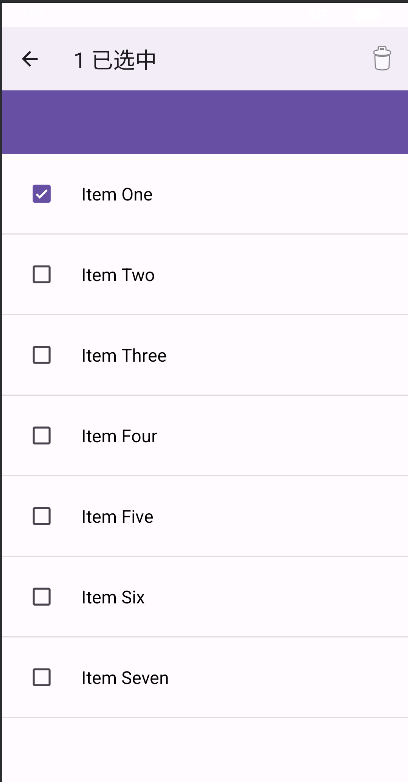

# ListViewDemo

一个 Android Studio 项目，用于演示 ListView 组件的各种用法和相关功能。

## 项目结构

```
ListViewDemo/
├── app/
│   ├── src/
│   │   ├── main/
│   │   │   ├── java/com/example/listviewdemo/
│   │   │   │   ├── MainActivity.java      # 基本 ListView 用法演示
│   │   │   │   ├── MainActivity2.java     # 自定义对话框演示
│   │   │   │   ├── MainActivity3.java     # Toolbar 和菜单演示
│   │   │   │   ├── MainActivity4.java     # ListView 多选模式演示
│   │   │   │   └── SelectableAdapter.java # 自定义多选适配器
│   │   │   ├── res/
│   │   │   │   ├── drawable/              # 图片资源（动物图片等）
│   │   │   │   ├── layout/                # 布局文件
│   │   │   │   ├── menu/                  # 菜单文件（上下文菜单、主菜单）
│   │   │   │   └── values/                # 资源值（颜色、字符串、主题等）
│   │   │   └── AndroidManifest.xml        # 应用清单文件
```

## 功能介绍

### 1. MainActivity - 基本 ListView 用法

- 使用 `SimpleAdapter` 实现图文混排的 ListView
- 显示动物名称和对应的图片（狮子、老虎、猴子、狗、猫、大象）
- 点击列表项显示 Toast 提示选中的动物名称
- 点击列表项发送系统通知（需要通知权限）
- 列表项之间有分割线
- 效果图

   

**代码介绍：**
```java
// 准备数据源（动物名称和图片）
private String[] animalNames = {"Lion", "Tiger", "Monkey", "Dog", "Cat", "Elephant"};
private int[] animalImages = {R.drawable.lion, R.drawable.tiger, R.drawable.monkey,
        R.drawable.dog, R.drawable.cat, R.drawable.elephant};

// 准备数据列表，用于SimpleAdapter
List<Map<String, Object>> dataList = new ArrayList<>();
for (int i = 0; i < animalNames.length; i++) {
    Map<String, Object> map = new HashMap<>();
    map.put("image", animalImages[i]);
    map.put("name", animalNames[i]);
    dataList.add(map);
}

// 创建并设置SimpleAdapter
SimpleAdapter adapter = new SimpleAdapter(
        this,  // 上下文
        dataList,  // 数据源
        R.layout.item_list,  // 列表项布局
        new String[]{"image", "name"},  // 数据键名
        new int[]{R.id.iv_animal, R.id.tv_animal}  // 布局控件ID
);
lvAnimal.setAdapter(adapter);

// 设置ListView点击事件
lvAnimal.setOnItemClickListener(new AdapterView.OnItemClickListener() {
    @Override
    public void onItemClick(AdapterView<?> parent, View view, int position, long id) {
        // 显示Toast提示
        Toast.makeText(MainActivity.this, "你选中了：" + animalNames[position], Toast.LENGTH_SHORT).show();
        // 发送通知
        sendNotification(animalNames[position]);
    }
});
```

### 2. MainActivity2 - 自定义对话框

- 演示如何创建和使用自定义对话框
- 包含用户名和密码输入框
- 实现基本的登录逻辑验证（非空检查）
- 点击 "Open Sign In Dialog" 按钮弹出对话框
- 支持取消和登录操作
- 效果图

   

**代码介绍：**
```java
// 绑定按钮并设置点击事件
btnOpenDialog = findViewById(R.id.btn_open_dialog);
btnOpenDialog.setOnClickListener(new View.OnClickListener() {
    @Override
    public void onClick(View v) {
        showCustomSignInDialog();  // 打开自定义对话框
    }
});

// 显示自定义登录对话框的方法
private void showCustomSignInDialog() {
    // 加载自定义布局
    View dialogView = LayoutInflater.from(this).inflate(R.layout.dialog_sign_in, null);
    
    // 绑定对话框控件
    EditText etUsername = dialogView.findViewById(R.id.et_username);
    EditText etPassword = dialogView.findViewById(R.id.et_password);
    Button btnCancel = dialogView.findViewById(R.id.btn_cancel);
    Button btnSignIn = dialogView.findViewById(R.id.btn_sign_in);
    
    // 创建对话框
    AlertDialog.Builder builder = new AlertDialog.Builder(this);
    builder.setView(dialogView).setCancelable(false);
    AlertDialog signInDialog = builder.create();
    
    // 取消按钮点击事件
    btnCancel.setOnClickListener(new View.OnClickListener() {
        @Override
        public void onClick(View v) {
            signInDialog.dismiss();
        }
    });
    
    // 登录按钮点击事件
    btnSignIn.setOnClickListener(new View.OnClickListener() {
        @Override
        public void onClick(View v) {
            String username = etUsername.getText().toString().trim();
            String password = etPassword.getText().toString().trim();
            
            if (username.isEmpty() || password.isEmpty()) {
                Toast.makeText(MainActivity2.this, "Please enter Username and Password", Toast.LENGTH_SHORT).show();
            } else {
                Toast.makeText(MainActivity2.this, "Sign In Success! Welcome, " + username, Toast.LENGTH_SHORT).show();
                signInDialog.dismiss();
            }
        }
    });
    
    // 显示对话框
    signInDialog.show();
}
```

### 3. MainActivity3 - Toolbar 和菜单

- 使用 Toolbar 替代默认的 ActionBar
- 实现文本大小调整功能（小/中/大）
- 实现文本颜色调整功能（红色/黑色）
- 演示普通菜单项的使用
- 中央显示测试文本用于演示效果
- 效果图

   

**代码介绍：**
```java
@Override
protected void onCreate(Bundle savedInstanceState) {
    super.onCreate(savedInstanceState);
    setContentView(R.layout.toolbar);
    
    // 设置Toolbar为ActionBar
    Toolbar toolbar = findViewById(R.id.toolbar);
    setSupportActionBar(toolbar);
    
    // 初始化测试文本
    initTestTextView();
}

// 创建并加载菜单
@Override
public boolean onCreateOptionsMenu(Menu menu) {
    getMenuInflater().inflate(R.menu.menu_main, menu);
    return true;
}

// 处理菜单项点击事件
@Override
public boolean onOptionsItemSelected(MenuItem item) {
    int itemId = item.getItemId();
    if (itemId == R.id.size_small) {
        testTextView.setTextSize(10);
        return true;
    } else if (itemId == R.id.size_medium) {
        testTextView.setTextSize(16);
        return true;
    } else if (itemId == R.id.size_large) {
        testTextView.setTextSize(20);
        return true;
    } else if (itemId == R.id.color_red) {
        testTextView.setTextColor(Color.RED);
        return true;
    } else if (itemId == R.id.color_black) {
        testTextView.setTextColor(Color.BLACK);
        return true;
    } else {
        return super.onOptionsItemSelected(item);
    }
}
}
```
   
### 4. MainActivity4 - ListView 多选模式

- 实现 ListView 的多选功能
- 长按列表项进入多选模式
- 支持批量删除选中项
- 使用自定义适配器 `SelectableAdapter` 管理选中状态
- 顶部显示已选中的项目数量
- 提供删除操作的上下文菜单
- 效果图

   

**代码介绍：**
```java
// 初始化ListView和数据
private void initListViewAndData() {
    mListView = findViewById(R.id.list_view);
    mListData = new ArrayList<>();
    
    // 添加测试数据
    mListData.add("Item One");
    mListData.add("Item Two");
    mListData.add("Item Three");
    mListData.add("Item Four");
    mListData.add("Item Five");
    mListData.add("Item Six");
    mListData.add("Item Seven");
    
    // 设置自定义适配器
    mAdapter = new SelectableAdapter(
            this, R.layout.item_list4, R.id.tv_item_text, mListData);
    mListView.setAdapter(mAdapter);
}

// 设置ListView多选模式
private void setupListViewMultiChoice() {
    mListView.setChoiceMode(ListView.CHOICE_MODE_MULTIPLE_MODAL);
    mListView.setMultiChoiceModeListener(new AbsListView.MultiChoiceModeListener() {
        @Override
        public void onItemCheckedStateChanged(ActionMode mode, int position,
                                              long id, boolean checked) {
            // 更新选中状态和标题
            mAdapter.setSelected(position, checked);
            mode.setTitle(mListView.getCheckedItemCount() + " 已选中");
        }
        
        // 其他接口方法实现...
        
        @Override
        public boolean onActionItemClicked(ActionMode mode, MenuItem item) {
            if (item.getItemId() == R.id.action_delete) {
                deleteSelectedItems();
                mode.finish();
                return true;
            }
            return false;
        }
    });
}
```

**SelectableAdapter核心代码：**
```java
public class SelectableAdapter extends ArrayAdapter<String> {
    private boolean[] mSelected; // 记录选中状态
    
    // 构造方法...
    
    @Override
    public View getView(int position, View convertView, ViewGroup parent) {
        View view = super.getView(position, convertView, parent);
        CheckBox checkBox = view.findViewById(R.id.cb_check);
        checkBox.setVisibility(isInSelectMode() ? View.VISIBLE : View.GONE);
        checkBox.setChecked(mSelected[position]);
        return view;
    }
    
    // 设置选中状态
    public void setSelected(int position, boolean selected) {
        mSelected[position] = selected;
        notifyDataSetChanged();
    }
    
    // 其他方法...
}
```

## 技术要点

- ListView 基本用法和适配器模式
- SimpleAdapter 和自定义适配器的实现
- 对话框的创建和自定义布局
- Toolbar 和菜单系统的使用
- ListView 多选模式和上下文菜单
- 通知的发送和权限处理
- 数据绑定和视图回收机制
