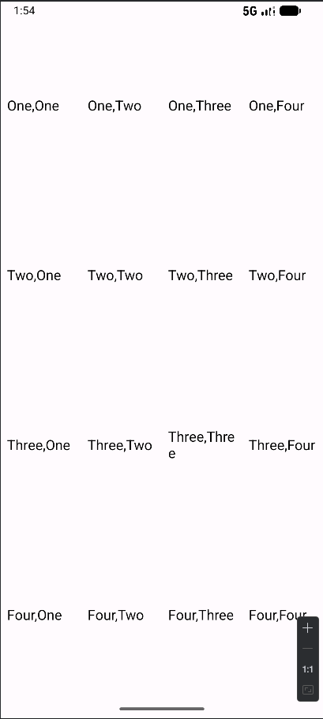
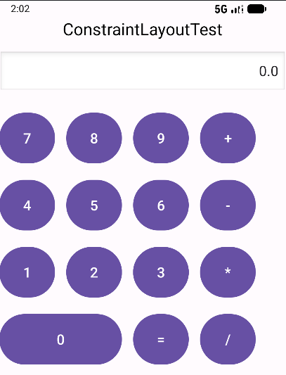
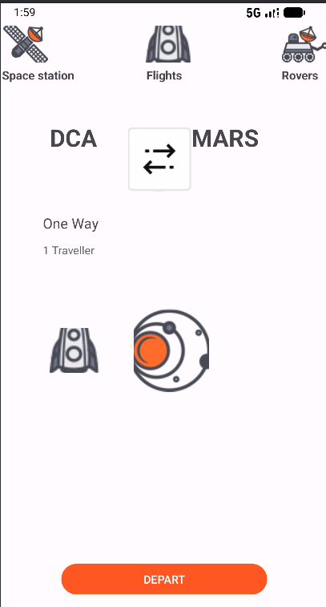
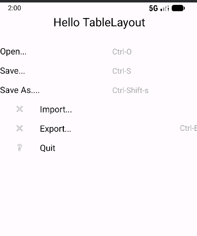

# AndroidLayoutExperiment

AndroidLayoutExperiment是一个用于演示和学习Android不同布局类型的实验项目。该项目包含了多种常见的Android布局实现，适合Android开发者学习和参考。

## 项目特点

- 演示多种Android布局类型
- 使用Kotlin语言开发
- 清晰的代码结构和注释
- 直观的界面设计
- 太空/火星主题的视觉效果

## 包含的布局类型

1. **LinearLayout（线性布局）**
   - 垂直和水平方向的线性排列
   - 使用权重分配空间
   - 效果图：
   
   
   
   **核心代码示例：**
   ```xml
   <!-- 垂直方向的LinearLayout -->
   <LinearLayout
       android:layout_width="match_parent"
       android:layout_height="match_parent"
       android:orientation="vertical">
       
       <!-- 水平方向的LinearLayout，使用权重分配空间 -->
       <LinearLayout
           android:layout_width="match_parent"
           android:layout_height="0dp"
           android:layout_weight="1"
           android:orientation="horizontal">
           
           <!-- 子View使用0dp宽度和权重分配空间 -->
           <TextView
               android:layout_width="0dp"
               android:layout_height="wrap_content"
               android:layout_weight="1"
               android:text="Item 1" />
           
           <TextView
               android:layout_width="0dp"
               android:layout_height="wrap_content"
               android:layout_weight="1"
               android:text="Item 2" />
       </LinearLayout>
   </LinearLayout>
   ```

2. **ConstraintLayout（约束布局）**
   - 基于约束关系的灵活布局
   - 多种约束条件的应用
   - 效果图

   
   
   
   
   **核心代码示例：**
   ```xml
   <androidx.constraintlayout.widget.ConstraintLayout
       android:layout_width="match_parent"
       android:layout_height="match_parent">
       
       <ImageView
           android:id="@+id/imageView"
           android:layout_width="100dp"
           android:layout_height="100dp"
           android:src="@drawable/galaxy"
           app:layout_constraintStart_toStartOf="parent"
           app:layout_constraintEnd_toEndOf="parent"
           app:layout_constraintTop_toTopOf="parent"
           app:layout_constraintBottom_toBottomOf="parent" />
       
       <!-- 使用约束条件精确定位 -->
       <Button
           android:id="@+id/button"
           android:layout_width="wrap_content"
           android:layout_height="wrap_content"
           android:text="Button"
           app:layout_constraintTop_toBottomOf="@id/imageView"
           app:layout_constraintStart_toStartOf="@id/imageView"
           app:layout_constraintEnd_toEndOf="@id/imageView" />
   </androidx.constraintlayout.widget.ConstraintLayout>
   ```
    
3. **TableLayout（表格布局）**
   - 表格形式的布局结构
   - 行列组织方式
   - 效果图
   
   
   
   **核心代码示例：**
   ```xml
   <!-- TableLayout定义表格容器 -->
   <TableLayout
       android:layout_width="match_parent"
       android:layout_height="match_parent"
       android:stretchColumns="1"> <!-- 拉伸第二列 -->
       
       <!-- TableRow定义表格行 -->
       <TableRow
           android:layout_width="match_parent"
           android:layout_height="wrap_content">
           
           <!-- 表格单元格 -->
           <TextView
               android:layout_width="wrap_content"
               android:layout_height="wrap_content"
               android:text="Name:" />
           
           <TextView
               android:layout_width="wrap_content"
               android:layout_height="wrap_content"
               android:text="Value" />
       </TableRow>
       
       <!-- 跨列示例 -->
       <TableRow>
           <TextView
               android:layout_width="wrap_content"
               android:layout_height="wrap_content"
               android:text="Header"
               android:layout_span="2" <!-- 跨两列 -->
               android:gravity="center" />
       </TableRow>
   </TableLayout>
   ```
## 项目结构 


``` 
AndroidLayoutExperiment/ 
├── app/ 
│   ├── src/main/ 
│   │   ├── java/com/example/androidlayoutexperiment/ 
│   │   │   ├── MainActivity.kt       # 主界面 
│   │   │   ├── LinearActivity.kt     # 线性布局演示 
│   │   │   ├── ConstraintActivity.kt  # 约束布局演示 
│   │   │   ├── Constraint1Activity.kt # 另一个约束布局演示 
│   │   │   └── TableActivity.kt       # 表格布局演示 
│   │   ├── res/ 
│   │   │   ├── layout/               # 布局文件 
│   │   │   │   ├── activity_main.xml 
│   │   │   │   ├── activity_linear.xml 
│   │   │   │   ├── activity_constraint.xml 
│   │   │   │   ├── activity_constraint1.xml 
│   │   │   │   └── activity_table.xml 
│   │   │   └── drawable/             # 图片资源 
│   │   └── AndroidManifest.xml 
│   └── build.gradle.kts 
├── gradle/ 
└── README.md 
```
